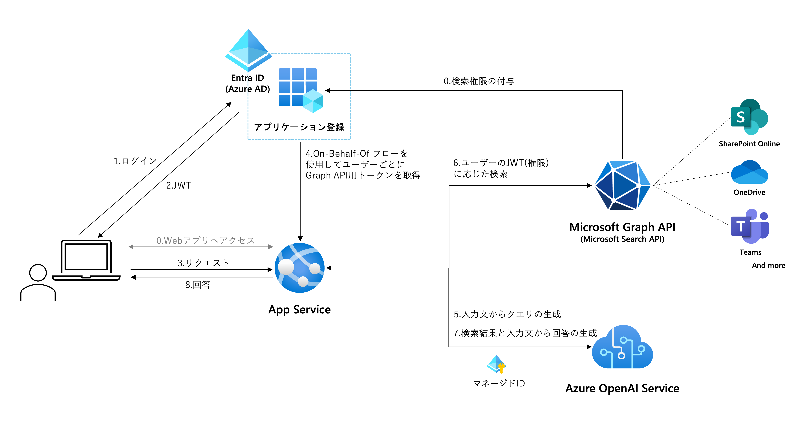
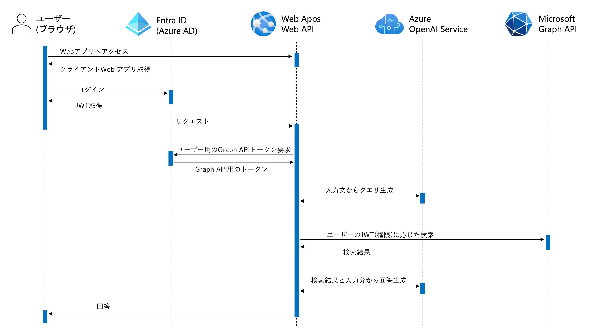

[English](./README_en.md)

# Microsoft Search API RAG サンプルアプリ

このサンプルは[Azure-Samples/azure-search-openai-demo](https://github.com/Azure-Samples/azure-search-openai-demo)をベースに開発されています。

## 概要
<!--ここにスクショを入れる-->

### 機能
- Microsoft 365内のドキュメントやサイト、Teamsの投稿などを基にしたLLMによるチャット形式の内部ナレッジ検索
- Microsoft 365でも使用されるMicrosoft Search APIを使用したシンプルかつ高精度なRAGアーキテクチャ
- [On-Behalf-Of フロー](https://learn.microsoft.com/ja-jp/entra/identity-platform/v2-oauth2-on-behalf-of-flow)を使用してユーザーの権限に応じた検索

### 技術概要
アーキテクチャ

シーケンス

## セットアップ方法
### 前提条件
- このリポジトリをクローンまたはダウンロード
- Azure OpenAI ServiceまたはOpenAIの準備
    - Azure OpenAI Service：GPT-35-turboまたはGPT-4のデプロイ
    - OpenAI：APIキーを取得
- ローカル実行を行う場合は以下の環境がローカルマシンに準備されていること
    - Python
    - Node.js

### 1.アプリケーション登録
1. [Azure Portal](https://portal.azure.com/)にログインします。
1. [Microsoft Entra ID](https://portal.azure.com/#view/Microsoft_AAD_IAM/ActiveDirectoryMenuBlade/~/Overview) > アプリの登録 の順に選択していき、アプリ登録一覧画面で「新規登録」を選択します。
1. 「名前」を入力します。（例：ChatGPT-GraphSearch）
1. 「サポートされているアカウントの種類」で「この組織ディレクトリのみに含まれるアカウント」を選択
1. 「リダイレクトURI」でプラットフォームを「シングルページアプリケーション(SPA)」、URIを「http://localhost:5173/redirect」に設定します。
1. 「登録」をクリックします。
1. 登録されたアプリ登録に移動し、ブレードメニューの「APIのアクセス許可」にアクセスします。
1. 「アクセス許可の追加」から「Microsoft Graph」>「委任されたアクセス許可」の順に選択していき「Files.Read.All」と「Sites.Read.All」にチェックを入れて「アクセス許可の追加」を選択します。
1. アクセス許可一覧に選択したアクセス許可がリストアップされていることを確認します。
1. ブレードメニューから「APIの公開」を選択して「アプリケーション ID の URI」の「追加」をクリックします。
1. 表示される「api://{UUID}」の状態のまま「保存」を選択します。
1. 同ページの「Scopeの追加」を選択します。
1. スコープ名に「access_as_user」と入力してその直下に「api://{UUID}/access_as_user」と表示されるようにするします。
1. 同意できる対象で「管理者とユーザー」を選択します。
1. そのほかの表示名や説明は任意の文章（＝初回ログイン時に委任を求める画面で表示される内容）を入力して「スコープの追加」を選択します。
1. ブレードメニューから「証明書とシークレット」を選択します。「新しいクライアントシークレット」を選択してクライアントシークレットを任意の説明と期間で追加します。
1. 作成されたシークレットの「値」をメモ帳などにコピーします。**シークレットの値は作成直後しか表示されません。メモせずに画面遷移をすると２度と表示できないのでご注意ください。**
1. ブレードメニューから「概要」を選択して表示される次の情報をメモ帳などにコピーします。
    - ディレクトリ(テナント)ID
    - アプリケーション(クライアント)ID

### 2.ローカル実行
1. ターミナルなどでクローンしたファイルの「src/backend」に移動して「pip install -r requirements.txt」を実行します。パッケージのインストールが完了するまでしばらく待ちます。
1. 別ターミナルなどを開きクローンしたファイルの「src/frontend」に移動して「npm install」を実行します。パッケージのインストールが完了するまでしばらく待ちます。
1. 「src/backend」内に.envファイルを作成して[.env-sample](./src/backend/.env-sample)に記載されている内容をコピーします。
1. それぞれの環境変数にメモした情報などを入力します。
1. 「src/backend」を開いているターミナルで「quart run」を実行します。
1. 「src/frontend」を開いているターミナルで「npm run dev」を実行します。
1. ブラウザで「http://localhost:5173/」にアクセスします。
1. 画面右上の「Login」ボタンをクリックして、アプリ登録を行ったディレクトリのユーザーアカウントでログインします。ログインに成功したら「Login」と表示されていた部分にユーザーのUPNが表示されます。
1. 入力エリアに質問を入力してチャットを開始します。

### 3.Azureへのデプロイ
￥

https://learn.microsoft.com/ja-jp/graph/sdks/choose-authentication-providers?tabs=python#on-behalf-of-provider