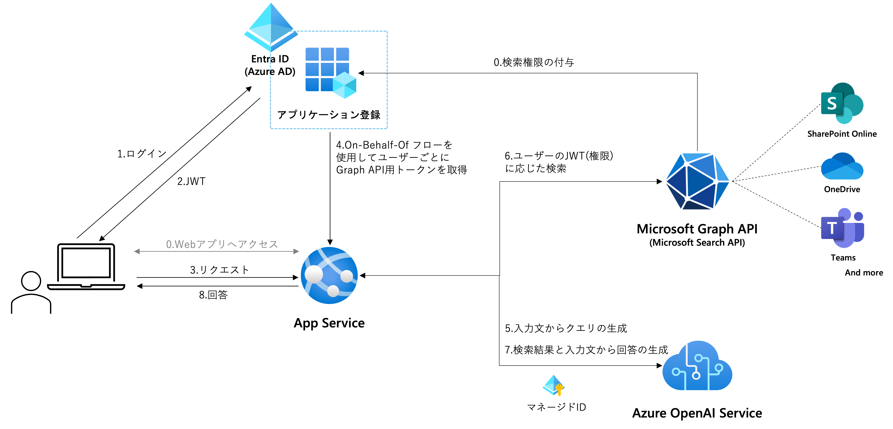

[Japanese](./README.md)

# Microsoft Search API RAG Sample app

This app based on [Azure-Samples/azure-search-openai-demo](https://github.com/Azure-Samples/azure-search-openai-demo).

## Overview
<!--ここにスクショを入れる-->

### Feature
- Chat-style internal knowledge search with LLM based on documents, sites, Teams posts and more within Microsoft 365
- Simple and accurate RAG architecture using the Microsoft Search API also used in Microsoft 365
- Search according to user permissions using [On-Behalf-Of Flow](https://learn.microsoft.com/en-us/entra/identity-platform/v2-oauth2-on-behalf-of-flow)

### Tech Overview
Architecturse

Sequence

## How to setup

https://learn.microsoft.com/ja-jp/graph/sdks/choose-authentication-providers?tabs=python#on-behalf-of-provider
