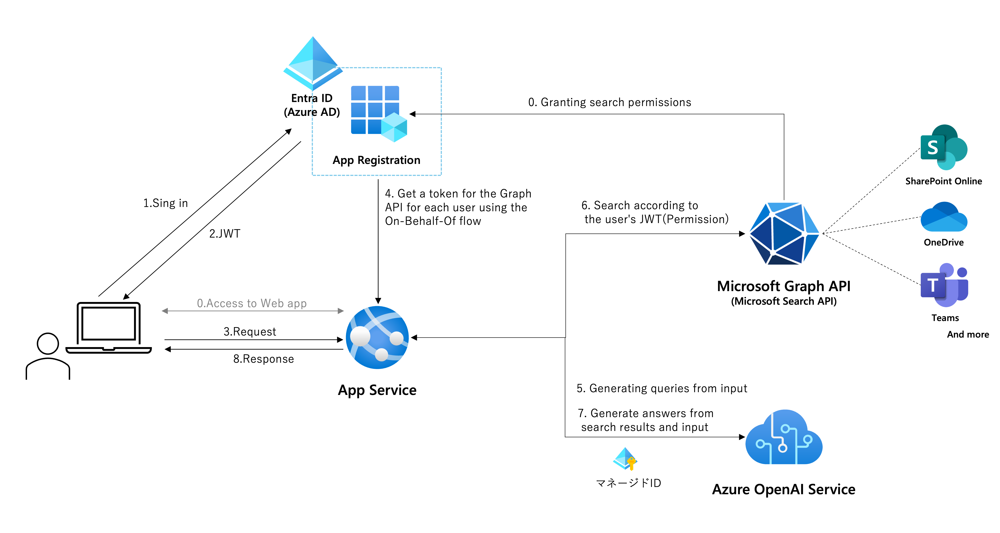
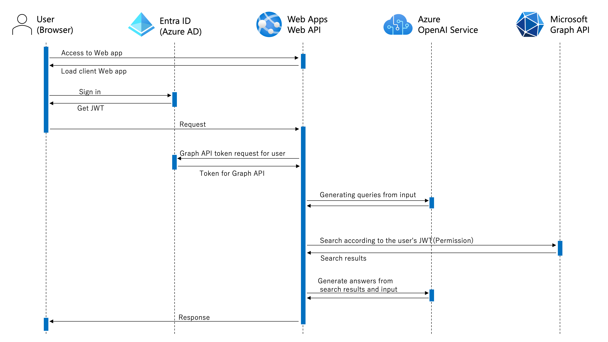

[Japanese](./README.md)

# Microsoft Search API RAG Sample App

This sample is developed based on [Azure-Samples/azure-search-openai-demo](https://github.com/Azure-Samples/azure-search-openai-demo).

> **Note**
> Note: The Microsoft Graph SDK for Python used in this sample is currently in [preview](https://learn.microsoft.com/en-us/graph/sdks/sdks-overview#supported-languages).

## Overview
<!--Insert screenshot here-->

### Features
- Chat-based internal knowledge search using LLM based on documents, sites within Microsoft 365, and Teams posts
- Simple and highly accurate RAG architecture using the Microsoft Search API also used in Microsoft 365
- Search based on user permissions using the [On-Behalf-Of Flow](https://learn.microsoft.com/en-us/entra/identity-platform/v2-oauth2-on-behalf-of-flow)

### Technical Overview
Architecture

Sequence

### Current Limitations
- Referencing reference documents in the Citation tab only works in the Microsoft Edge browser due to restrictions on propagating authentication information via iframe. Other browsers do not work (https://github.com/07JP27/azureopenai-internal-microsoft-search/issues/12).
- Streaming mode is not currently implemented (https://github.com/07JP27/azureopenai-internal-microsoft-search/issues/9).

## Setup
### Prerequisites
- Clone or download this repository
- Azure OpenAI Service or preparation for OpenAI
    - Azure OpenAI Service: Deploy GPT-3.5-turbo or GPT-4
    - OpenAI: Obtain API key
- Ensure the following environment is prepared on the local machine for local execution
    - Python
    - Node.js

### 1. Application Registration
1. Log in to [Azure Portal](https://portal.azure.com/).
1. Select [Microsoft Entra ID](https://portal.azure.com/#view/Microsoft_AAD_IAM/ActiveDirectoryMenuBlade/~/Overview) > App registrations in order, and choose "New registration" on the App registrations page.
1. Enter a "Name" (e.g., ChatGPT-GraphSearch).
1. Select "Accounts in this organizational directory only" under "Supported account types."
1. Set the platform to "Single-page application (SPA)" and set the URI to "http://localhost:5173/redirect" under "Redirect URI."
1. Click "Register."
1. Go to the registered app registration, and access "API permissions" in the blade menu.
1. Select "Add a permission" and choose "Microsoft Graph" > "Delegated permissions" in order. Check "Files.Read.All" and "Sites.Read.All," then select "Add permissions."
1. Confirm that the selected permissions are listed in the permissions list.
1. Select "Expose an API" from the blade menu and click "Add a scope" for "Application ID URI."
1. Keep the state of the displayed "api://{UUID}" and select "Save."
1. Select "Add a scope" on the same page.
1. Enter "access_as_user" in the scope name, and make sure "api://{UUID}/access_as_user" is displayed directly below it.
1. Choose "Admins and users" for the consentable audience.
1. Enter any text for the display name and description (i.e., the content displayed on the screen requesting delegation during the first login), and select "Add scope."
1. Select "Certificates & secrets" from the blade menu. Choose "New client secret," add a client secret with any description and duration.
1. Copy the value of the created secret to Notepad or another tool. **Note that the secret value is only displayed immediately after creation. Be careful not to navigate away from the screen without saving it.**
1. Select "Overview" from the blade menu and copy the following information displayed to Notepad or another tool.
    - Directory (tenant) ID
    - Application (client) ID

### 2. Adjust Prompts
Adjust the prompts described in `system_message_chat_conversation`, `query_prompt_template`, and `query_prompt_few_shots` in the following file according to your needs:
https://github.com/07JP27/azureopenai-internal-microsoft-search/blob/52053b6c672a32899b5361ae3510dbe0c40693c6/src/backend/approaches/chatreadretrieveread.py#L29

### 3. Local Execution
1. Move to "src/backend" of the cloned files in the terminal and execute "pip install -r requirements.txt." Wait for the package installation to complete.
1. Open another terminal or similar, move to "src/frontend" of the cloned files, and execute "npm install." Wait for the package installation to complete.
1. Create an .env file in "src/backend" and copy the contents from [`.env-sample`](./src/backend/.env-sample).
1. Enter the information saved in Notepad or other tools for each environment variable.
1. In the terminal with "src/backend" open, execute "quart run."
1. In the terminal with "src/frontend" open, execute "npm run dev."
1. Access "http://localhost:5173/" in the browser.
1. Click the "Login" button in the upper right corner of the screen and log in with the user account of the directory where the app registration was performed. Once logged in successfully, the user's UPN will be displayed in the part where "Login" was shown.
1. Enter a question in the input area and start the chat.

### 4. Deployment to Azure
TBW